<div align="center">
  
</div>

<div align="center">
  <sub><code>~/security</code> · Addis Ababa, Ethiopia · building offensive security skills one lab at a time</sub>
</div>

<br/>

```
$ cat about.md
```
# Abreham AKA Ambrose

Cybersecurity student focused on offensive security. I learn by doing —
labs, CTFs, and rebuilding real attack chains until I understand every
step of them, not just the payload that worked.

```
$ cat focus.md
```

<table>
<tr>
<td valign="top" width="50%">

**Right now**
- Penetration Testing
- Active Directory
- Web Application Security
- Network Security
- Windows Internals

</td>
<td valign="top" width="50%">

```
$ cat goals.md
```

> Build practical skills through continuous learning, hands-on labs, and
> security research. No shortcuts — understand the "why" behind every
> exploit before relying on it.

<br/>

<div align="center">
  
  
</div>


<div align="center">
  
</div>

<br/>

```
$ contact --info
```

<p align="center">
  <a href="https://github.com/AbreshZF"></a>
  <a href="https://www.linkedin.com/in/abreham-zerfu-aka-ambrose"></a>
  <a href=""></a>
</p>

<div align="center">
  <sub><code>$ exit</code> — logged out, back in the labs</sub>
</div>
